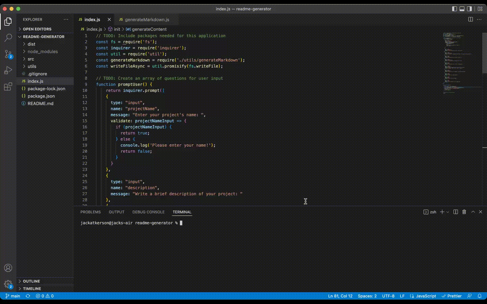

# Node.js README.md Generator

## Description
This is a README generator that uses Node.js to populate template fields with user data entered upon execution of the application. Below is a video showing the functionality of the application:

## Table of Contents
- [Installation] (#installation)
- [Usage] (#usage)
- [Credits] (#credits)
- [Questions] (#questions)

## Installation
Copy the GitHub repo to your local work environment. Then, install npm with the command "npm init". After npm is installed, install inquirer with the command "npm install inquirer".

## Usage
Run the command "node index.js" from the command linento initiate the application.
## Credits
Made by Jack Atkerson

## Questions
Feel free to reach out to me at:
[E-Mail](mailto:jatkerson18@gmail.com),
[GitHub](https://github.com/JackAtkerson)